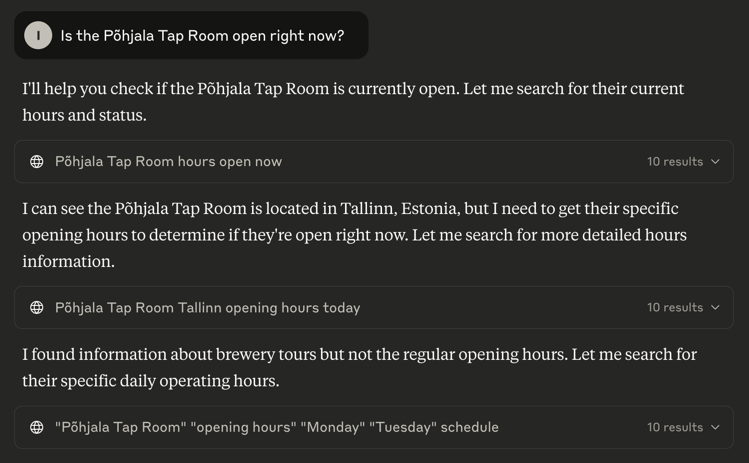
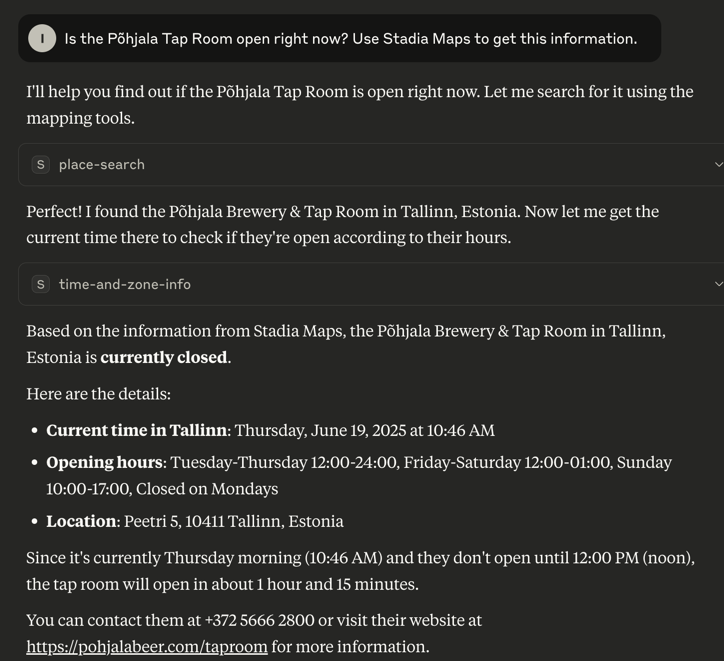

# Stadia Maps MCP Server (TypeScript)

This is a Model Context Protocol (MCP) server
that provides AI assistants with access to Stadia Maps APIs for location services, geocoding, routing, and mapping capabilities.

## Capabilities

- Time information anywhere on earth
  - Current time
  - Time zone info (ID, UTC offset, and whether a special offset like daylight saving/summer time is in effect)
- Geocoding
  - Address lookup
  - Place search (POIs like restaurants, cafes, etc.)
- Static map image generation (including markers and route overlays)
- Routing & travel time
- Isochrones (reachable range; both time and distance contours)

### Use cases

Here are just a few of the ways you can prompt an LLM
to make use of the tools:

- "What time is it in Tokyo?"
- "Make me a map showing the walking route from Depoo Turg to the Põhjala Tap Room."
- "Is the Põhjala Tap Room open right now? Use Stadia Maps to get this information."
- "Geocode the addresses in the attached spreadsheet."

## Quickstart

## Building

We'll use `bun` for all of our instructions,
but you can use `npm` too.

1. Run `bun install` to fetch the dependencies.
2. Then, execute the build script: `bun run build`.

The built code should be in the `build` directory now.

### Configuration

This MCP server requires a Stadia Maps API key.
Follow the directions [here](https://docs.stadiamaps.com/authentication/#api-keys) to get your free key.
Then, set the `API_KEY` environment variable when running the server.

## Integration Examples

API key in hand, here are a few ways you can use the MCP server.

### Claude Desktop

See [Claude Desktop Setup](claude-desktop-setup.md) for detailed instructions
on configuring this MCP server with Claude Desktop.
Claude Desktop is a great tool for testing out workflows

### Programmatic Integration with Anthropic SDK

For developers who want to integrate the MCP server programmatically into their TypeScript applications,
we have an [Anthropic SDK Integration Example](examples/README.md#anthropic-sdk-demo).
This example demonstrates how to:

- Connect to the MCP server from your code
- Integrate with Claude's API for natural language queries
- Enhance Claude with spatial intelligence using the Stadia Maps APIs via an MCP server

## Tips and Tricks

LLMs are far from perfect,
and sometimes you need to put some thought into crafting prompts
to get good results.

### When possible, be specific about which tool(s) to use

Sometimes the model needs a nudge to use the right tool.
For example, if you ask for opening hours,
many models will try to search the web.
This information isn't always easily available for the model to find online.

For example, watch what a model does here:

You can nudge the model to use the tools in this MCP like so:

### Get creative

LLMs are capable of a lot, but they can't always do everything.
As an example, let's look at one way to bulk geocode addresses in a spreadsheet.

First, attach an Excel sheet in Claude Desktop which has a few addresses in a column.

**Prompt:** Geocode all the addresses in this spreadsheet. Add the geocoded latitude and longitude as new columns in the sheet.

At the time of this writing, Claude cannot generate a spreadsheet attachment
directly, but it _can_ generate an HTML page or other code which generates it for you!
In fact, Claude Desktop may actually ask you if you want an Excel sheet download,
but it will just go ahead and generate this for you instead.

This sort of creativity is necessary, particularly when interacting with current
generation LLMs through the usual user interfaces.
A lot of the power of MCPs
is that you can interact with them through code,
which can overcome some of these limitations to provide a delightful user experience.

### Customize it!

Just like a human, LLMs do better when given the right tools for the job.
And just like a master craftsman, you'll probably need _some_ expert knowledge
to know how best to combine the right tools and materials.

Additionally, models have a context limit.
While there are advanced techniques to squeeze more out of this,
you can only benefit by tailoring the MCP to the specific API functionality you need.
Not to mention, it will be _much_ cheaper for you to operate with just the tools you need
for a specific context.
**Tool schemas are vast majority of the context cost, in a simple demo!**
If you build the suite out to ~10 tools, you can end up with tens of thousands of input tokens.

**This project is a starting point**,
and we've left comments throughout [`index.ts`](src/index.ts) noting our approach to building tools,
and how you can tailor them for your use case.
