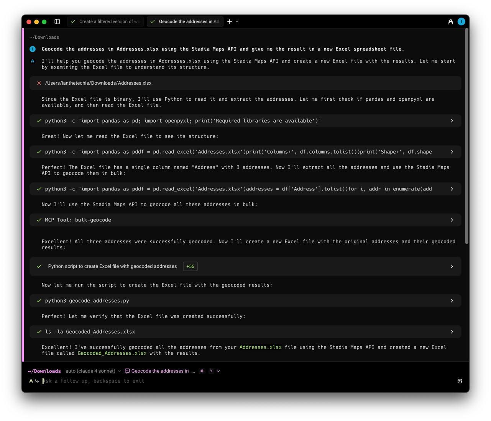

# Warp Setup

To set up an MCP in [Warp](https://www.warp.dev/), follow these steps:

* Open the Settings panel
* Select the AI tab and click "Manage MCP Servers"
* Fill out the missing pieces in the JSON template

The JSON format is almost identical to Claude Desktop.
As before, you'll need the full path to the nodejs executable, and the built MCP server:

```json
{
  "stadiamaps": {
    "command": "/path/to/node",
    "args": [
      "/path/to/stadiamaps-mcp-server-ts/build/index.js"
    ],
    "env": {
      "API_KEY": "YOUR-API-KEY"
    },
    "working_directory": null,
    "start_on_launch": true
  }
}
```

Here's an example session:


